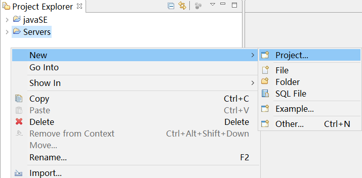
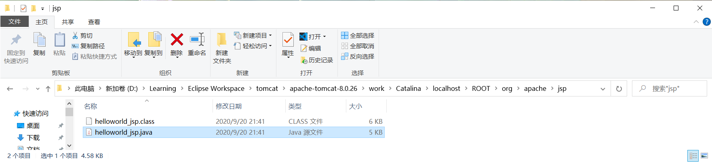

# 什么是JAVA Web?

1. 使用Java语言开发基于Web的应用(基于互联网的应用);

2. 在服务端为多种客户端提供网络服务

## Web应用的优点:

1. 免于更新
2. 体积小,节省空间
3. 随访问随用

## 软件基本体系结构的引出(三层架构)

$$
三层架构=\left\{
\begin{aligned}

& Client\left\{
        \begin{aligned}
        & 桌面应用 \\
        & 浏览器应用\\
        & 移动端应用\\
        \end{aligned}
		\right.& 客户端层&(前端) \\
& Sever\left\{
        \begin{aligned}
        & Java Sever \\
        & .Net sever\\
        & Php sever\\
        & Node.js (javascript的服务端)\\
        & PythonSever
        \end{aligned}
		\right.&服务端层&(后端)\\
& DataBase\left\{
        \begin{aligned}
        & 关系数据库 \left\{
        	\begin{aligned}
        	& Oracle\\
        	& Db2\\
        	& SQL Sever\\
        	& MySQL\\
        	\end{aligned}
        	\right.\\
        & 非关系数据库\left\{
        	\begin{aligned}
        	& Redis\\
        	& MongoDB\\
        	& Cassandra\\
        	& Neo4J\\
        	\end{aligned}
        	\right.

        \end{aligned}
		\right.&数据库层&(后端)
\end{aligned}
\right.
$$

### 关系数据库与非关系数据库的区别:

1. 组织数据的方式是否为关系模型:
2. 非关系数据库无范式概念;
3. 两种数据库无优劣之分,只有互补的区别;

### 服务端开发相关技术点

1. 高并发服务器

### 数据库方向相关技术点

1. 数据的分布式存储
2. 数据的冗余处理
3. 数据的灾难恢复

## 学习目标:

做出类似于学校教务在线的Java Web的应用

# Java Server的概念以及应用场景

## 三种客户端与Java Sever进行数据交换的区别

### 桌面应用程序与Java server连接的两种方式
#### 直接与Java Sever连接(仅支持Java语言客户端)
1. 通过TCP协议连接Socket server(经过MINA框架)
2. 若使用Java Sever作为架构中的服务器,应保证客户端也是用Java语言进行开发
#### 经由HTTP协议传输数据
1. 通过HTTP(s)协议->TCP协议->Web Service->Web Sever->Servlet->Socket server(经过MINA框架)
2. 适用于客户端与服务器使用不同语言开发的客户端
### 移动端应用程序
经由HTTP协议传输数据(同桌面应用开发);

JSON格式经由WebService传输数据

前后端分离:只传递数据,通过JSON格式;

### 网页应用程序

能够直接解析HTML文件,免于经过Web Service,直接访问Web Sever(前后端不分离)

## 课程重点:						

```
Socket Sever --- Web Sever --- Browser
```

使用Java Servlet 开发程序,部署到 Tomcat (Web Sever)上

### 知识点基础

- Java语言

- 关系数据库(JDBC)

- HTML(5),CSS

- JavaScript

- Xml

- http 协议

# 开发工具与教材:

## 开发工具以及环境

- Java SDK
- Eclipse
- Tomcat
- MySQL数据库

## 教材相关:


# Hello World的开发

## 开发环境的搭建

### Eclipse的安装

### Tomcat插件的安装


#### 三个猫猫按钮的显示


从左至右分别是:

- 启动Tomcat服务器
- 停止服务器
- 重新启动服务器

#### Tomcat插件确定本地Tomcat位置

- Prefences中添加本地Tomcat目录()

  

#### Tomcat中确定项目的位置

- 找到Tomcat所在文件夹

  

- 找到目录下的conf文件夹下的server.xml文件

- 找到其中的端口号8080,将其修改为2020(未被占用的端口号)

  

- 找到 appBase,docBase(Host name处)等属性,若少一行则自己补上

  

  - 将appBase设为项目所在目录;

  

  - 将docBase设为 项目名/WebContent的路径:

    

    - 注意:所有代码文件都被放置在WebContent下
      - 项目中src文件夹中放置所有java源代码;
      - 项目中WebContent文件夹中放置所有jsp代码;
      - 在WebContent/Web-INF/classes目录下放置java编译后的class文件;
      - Context path中不需要加任何值;

## 新建一个JavaWeb项目

1. 新建Dynamic Web Project(Project中寻找)

  

  

2. 设定项目名,设定Tomcat

   

   1. 已配置好Tomcat:

      1. TargetRuntime(运行的目标服务器)中选择对应Tomcat版本

   2. 未配置好Tomcat:

      1. NewRuntime中选择待安装Tomcat版本

         

      2. 选择已经下载好的Tomcat路径(主目录路径)

         

      3. Finish

## Java Web项目的结构

- src: 

  - 源代码文件

- WebContent:

  - HTML
  - CSS
  - 图片文件
  - jsp文件
  - Javascript文件

- WEB-INF:

  - 生成web.xml用于配置服务器相关属性(创建项目时可以设定)

    

  - 需要将编译生成的.class文件放置在此文件夹下的classes文件夹中

    - 在项目属性中的更改方法

  - lib文件夹下存放项目中需要使用的第三方jar包

## 使用jsp文件方式显示HelloWorld

- JSP文件又被称为JAVA SEVER PAGE文件

### 创建一个jsp文件

- 在WebContent文件夹下新建一个jsp文件

  

- 在创建好的JSP文件中直接编辑源代码

  - 在<body>与<body>之间加入helloworld

    

### 在浏览器中访问页面显示

- 直接在服务器上运行此项目

  

- 首次使用服务器时需要确定如下设定

  

- 显示helloworld(注意网址的正确性)

  

  - 网址:

    ```
    localhost:默认端口号/项目名/jsp文件
    ```

- 将sever.xml配置好项目路径后即可使用对应链接直接访问JSP文件(单纯启动服务器,在浏览器中输入链接)

  - 此时的链接为

    ```
    localhost:默认端口号/jsp文件
    ```

    

- 再次更改代码,加入一些文字并重新启动服务器

  

  

  - 另一种显示Helloworld的方式:在项目处Run As

    

    - 注意,此时运行的HelloWorld网页路径为:

      ```
      localhost:默认端口号/项目名/jsp文件
      ```

    

- 简单总结:

  - 使用项目来将JSP文件RunAs在Tomcat上时,路径中应包含项目名
    - 但是此种运行方式并不推荐,以后不会再使用
    - 使用项目在Tomcat上运行时,直接将整个项目部署在服务器上,因此寻找Hello.jsp时需要带着路径;
  - 直接启动Tomcat后路径中不包含项目名
    - 直接启动Tomcat服务器是将xml文件中设定好的路径(已包含项目名,即确定唯一项目)部署到服务器上,所以可以直接找到JSP文件,无需加上项目名;
  - Context path:一般设定为空串,用于区分不同项目中的JSP文件;
    - 如果要填写一些字符串,需要在URL中的JSP文件名前加上Context path中的值
  - helloworld到底在哪?

## 使用Servlet方式显示HelloWorld

### Tomcat是如何运行JSP程序的?

#### 问题的引出

- Tomcat是Java服务器,能够运行Java程序;
- JSP中的HTML语言所形成的字符串为何能在Tomcat中运行?

#### JSP文件的Java源代码

- 在如下路径中可以找到与JSP文件同名的.Java文件

```
D:\Learning\Eclipse Workspace\tomcat\apache-tomcat-8.0.26\work\Catalina\localhost\ROOT\org\apache\jsp
```



- 打开.java文件可以找到相应的HTML字符串


- 其中,out是一个JAVA对象,通过调用write方法输出
- 所以jsp程序在Tomcat中运行时,在原有的jsp代码中添加许多java框架,从而转化为java源代码,进而在Tomcat中运行;

###  自己建立一个Java项目用于完成Helloworld

#### 建立一个Java项目

1. 建立一个Java包
2. 确定好包名
3. 创建一个Java类
4. 设定好类名

#### Helloworld代码

由JSP文件的java代码可以确定,新建立的主类一定要继承某个类(用于Tomcat服务器)

导入 javax.servlet.http.HttpServlet包;

在主类内继承HttpServlet类,后重写父类的service方法;

在服务器端显示数据,需要使用arg1参数调用输出流函数;


最终展示的源代码如下:


### 关联网址URL与Servlet类

客户端请求与Helloworld类相关联,需要修改web.xml文件

#### \<servlet>标签下的工作:

创建servlet标签,servlet类标签,关联这两个标签

1. \<servlet-name>Servlet\</servlet-name>
   1. 定义一个Servlet名 
2. \<servlet-class>Servlet类名\</servlet-class>
   1. 确定一个已有的Servlet类

#### \<servlet-mapping>标签下的工作:

在此标签内关联\<servlet-name>和\<url-pattern>标签

1. \<servlet>标签下所定义好的Servlet名
   1. 确定连接成员A
2. \<url-pattern> url名\</url-pattern>
   1. 直接反映在连接中项目目录下的url

- 在\<servlet-mapping>标签中:
  - \<url-pattern>与\<servlet-name>关联
- 在\<servlet>标签中:
  - \<servlet-name>与\<servlet-class>关联
- 这样\<url-pattern>与\<servlet-class>通过用户定义的\<servlet-name>连接成功,在浏览器访问对应URL时,可以直接将表单中获得的数据交给Servlet类以执行

# 注意: 

- 写完代码运行前要保存
- 在浏览器中使用此链接查看Helloworld

```
http://localhost:2020/hw
```

