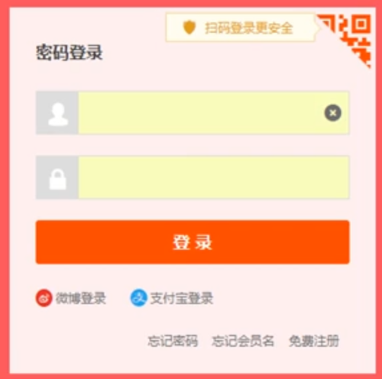
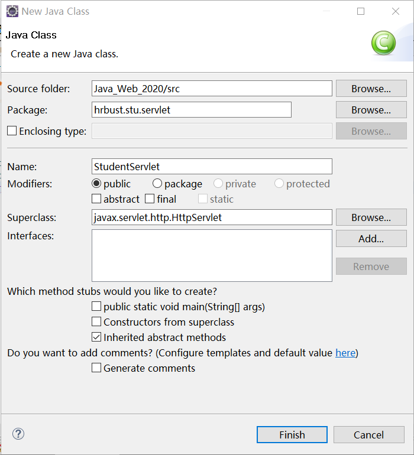

# 服务端与浏览器(B/S结构)

浏览器发送请求
服务端接受请求
请求信息在服务端被处理（访问数据库/）后将响应信息回传
这种操作类似于JAVA中的文件操作：
文件输入流:要处理文件，站在CPU的角度来说，数据从文件中流入
文件输出流同理；

浏览器与服务的之间传输数据的操作：网络编程，需要封装
协议头：网络端口号/
协议体：待传输数据

# 表单的处理

## 表单：(前台获取数据的途径)
用户的登录界面（需要添加用户名和密码的界面）

### 淘宝的登录界面:



1.  用户输入对应用户名与密码进行登录,
2. 网站为防止恶意登录需要用户填写验证码
3. 二维码的作用：
   1. 手机扫描二维码时，手机访问二维码的网页将手机中的用户登录信息输入网页端界面中

#### 查看淘宝登陆界面的页面源代码:


- 网页源代码,包含许多HTML标签:
  1. \<form action="xx" method="post" id="xx">
     1. action:	表单中输入的参数需被提交至哪个HTML页面
     2. method:
        1. GET:
        2. POST:
  2. \<input type="text" name="TPL_username" xx>
  3. \<input type="password" name="TPL_password" xx>
  4. \<button type="submit" xx > 登录 \</button\>
- HTML产生初期的问题：
  1. HTML标签规范度较小:不同的浏览器可能出现同一网页无法打开的情况
  2. 在前端页面中获取的登录信息需要被传送至后端

### 百度的搜索界面


1. 百度识图搜索：图片文件上传组件
2. 同样是表单,用于向后端提交一些数据;
3. 传递数据时也可以使用JavaScript来传递数据,但表单提交数据是最为简单的方法

#### 百度首页界面的网页源代码:


- 搜索界面中的源代码:
  1. \<form name=xx action=/s class=xx onsubmit="xx"> xx\</form>
     1. action:需要提交给 /s 程序
     2. onsubmit:调用JavaScript程序;符合条件提交数据
  2. \<input type= text class=xx name=wd xx>
     1. 输入框,name 表示文本框的名字
  3. \<input type =submit value="百度一下" xx> 
     1. 按钮

## 表单中的重要组件：

### form标签:

- 表单框架

### 输入组件:

- 基本概念:
  - 嵌套于form标签中,用于输入用户信息
  - 若网页不需要表单，则使用其他方法获得用户信息
- 一些较为重要的输入控件:
  - 文本框
  - 密码框
  - 复选框
  - 下拉菜单
  - 文件上传

### 提交组件:

- 用户输入完信息后,用于向后台提交数据的按钮(也可以是回车)

### 请求处理器:

- 用于处理用户提交的数据的程序/代码段
- 由form标签中的actions属性决定
  - 百度界面:/s
  - 淘宝界面:/member/login.jhtml

## 总结:

- 用户在浏览器中的对应页面的表单中输入用户信息
- 在Web应用中,用户的数据通过**名值对的方式**传递给后端
  - 名值对的方式:参数名-参数值

# 创建一个表单

## 新建立一个HTML文件

1. 对应项目文件下新建立一个HTML文件:


2. 更名为student.html


## 书写HTML文件中表单源代码

- 两个body标签之间添加如下表单代码
- **\<br>标签**和**\<p>标签**均表示换行

```html
<form action="/s">
    名称<input type="text" name="stuname" > <p>
	密码<input type="password" name="stupass" > <br>
    <input type="submit" value="提交">
</form>
```

- 使用Eclipse中内置浏览器打开HTML页面可显示表单显示情况

  

- 未加换行标签

  

- 添加换行标签

  

  - 此时文本框长度可以明显长度不同,可以通过修改某些属性或使用CSS来对外观进行控制

- 添加提交按钮

  

- 需要定义一个Servlet类与action指向的/s所关联,这样Java Servlet就能够获取到前端页面中的数据,进而将其处理

## Servlet类的建立

### 新建项目中的包

- 在Java Resources文件夹下的src文件夹下新建一个包

- 将包命名为hrbust

- 在hrbust下新建包hrbust.stu.servlet;(建了两层包)

  

### 新建Servlet类

- 在hrbust.stu.servlet包中添加StudentServlet类
- 点击Broswer查找要继承的类(HttpServlet)

### 关联action中的/s与Servlet类

- 与HelloWorld中关联Servlet类与url连接工作相同,修改WebContent下的web.xml文件:
- /s与 hrbust.stu.servlet包中的StudentServlet类进行关联
- 数据的流向:
  - 表单的数据->form标签中的action->/s->StudentServlet类

### Servlet类的编写
1. 创建时继承HttpServlet类;

2. 覆盖Service方法:

   1. 选择重写函数
   2. 选择service方法(基于HttpServlet)

   3. 参数:
     
      1. arg0:	HttpServlet接收到的请求(Request)
      2. arg1:	HttpServlet发送出的响应(Response)
      
   2. 测试参数是否能正确传递:

       1. 在浏览器页面中

   ```java
   arg1.getWriter().println("收到请求");
   ```

   ​							ii.在控制台中输出

   ```java
   System.out.println("get request from broswer");
   ```

# 表单的进一步丰富 

## 在原有表单中中添加新属性(年龄,性别)

- input中的type="radio" 	表示 单选按钮
- radio中的checked属性	表示 默认选择项
- \&nbsp;	表示输出一个空格
- input中的type="checkbox"  表示 复选按钮
- select 控件 表示下拉选择菜单
- 设定Select的选项时使用option标签中的value属性

```html
<form action="/s">
	名称	<input type="text" name="stuname" >	<p>
	密码	<input type="password" name="stupass" > <br>
	年龄	<input type="text" name="stuage"> <br>
	性别	<input type="radio" name="stusex" checked="checked" value="M"> 男&nbsp;&nbsp;
		<input type="radio" name="stusex"value="F"> 女<br>
	爱好	<input type="checkbox" name="stuhobbies" value="Basketball">篮球&nbsp;&nbsp;
		<input type="checkbox" name="stuhobbies" value="Soccer">足球&nbsp;&nbsp;
		<input type="checkbox" name="stuhobbies" value="TableTennis">乒乓球&nbsp;&nbsp;
		<input type="checkbox" name="stuhobbies" value="Movies">看电影<br>
	学院	<select name="school">
			<option value="software">软微学院</option>
			<option value="computer">计算机学院</option>
			<option value="mechanics">机械学院</option>
		</select><br>	
    <input type="submit" value="提交">
</form>
```

## 查看Servlet参数是否正确传递

- 将各个从表单中获取的参数Request调用getParameter函数获取对应表单中设定好的变量名
- 由于年龄应是整型变量,需要再转化为字符串后再次转化为整形
- Request和Response是网络数据包的封装(网络协议+传输数据)

```java
protected void service(HttpServletRequest Request, HttpServletResponse Response) throws ServletException, IOException {
		// TODO Auto-generated method stub
		//super.service(arg0, arg1);
		Response.getWriter().println("get request");
		String name = Request.getParameter("stuname");
		System.out.println(name);
		String password = Request.getParameter("stupass");
		System.out.println(password);
		String Age = Request.getParameter("stuage");	
		int age =Integer.parseInt(Age);
		System.out.println(age);
		String Sex = Request.getParameter("stusex");
		System.out.println(Sex);  
		String [] hobbies=Request.getParameterValues("stuhobbies");
		System.out.println("爱好:");
		for(String h: hobbies)
		{
			System.out.println(h);
		}
		System.out.println("\n");
		String school=Request.getParameter("school");
		System.out.println(school);		
	}
```

## 表单中的同名属性的区分:

- 假设在配置表单时,将多个属性设置为一个名字
  - 这种情况是错误的,应该避免
- 可以调用getParameterValues函数,返回一个String数组,同名属性的多个数据根据序号区分
- 由此对于多值的属性,可以使用此函数(hobbies)来提取数据

## Service函数所传递参数的内容

1. 获取表单数据的参数值函数:getParameterValues

2. 获取表单数据的参数的映射(Map)函数:getParameterMap

   1. 定义一个Map存储此函数的返回值

   2. 定义两层循环遍历所有数据

      ```java
      Map<String,String[]> map = Request.getParameterMap();
      for(String k: map.keySet())
      {
          String[] vs = map.get(k);
          System.out.println();
          for(String v:vs)
          {
          	System.out.println(v+",");
          }
      }
      ```

      

3. 获取表单数据的参数名字的函数:getParameterNames

4. Cookie:浏览器用于缓存用户的信息

5. 协议头(域名,端口号)

6. 表单数据的提交方式

# 浏览器向后台传递数据的方式:

form标签中的method属性处修改

## GET方式:

- 会直接在浏览器地址栏中显示对应待传输的数据
- method未被赋值时默认是GET方式
-  幂等性:(搜索引擎常用)
  - 同样的链接在执行多少次都能得到相同的结果;(刷新页面不变)
  - 不追求私密性,并且要根据链接的不同可确认不同的网站

## POST方式:

- 不会直接在浏览器地址栏中显示对应待传输的数据,可以隐藏数据
- 不具有幂等性
  - 连接执行多次后结果会发生变化(刷新页面变化)

## 注意:

- URL不支持中文,中文搜索结果使用16进制表示

# Tomcat

## Tomcat的容器性质：
 Tomcat一般被称为服务器，但也可被称为容器，他会接管生存在容器中的对象的创建与销毁，这样使得Init方法与destroy方法由Tomcat调用；

## Tomcat中的自动重启功能:

- 在Tomcat配置中添加了一段属性,可以保证再修改表单HTML并保存后,直接重启服务器
- 位与Tomcat/conf/sever.xml服务器配置文件中的reloadable属性;

# 推送消息的实现方法：
本质仍然是客户端服务器之间的发送数据方式：服务端等待客户端发送消息；JavaScript脚本自动执行

MVC：将显示的值与真实值进行区分
