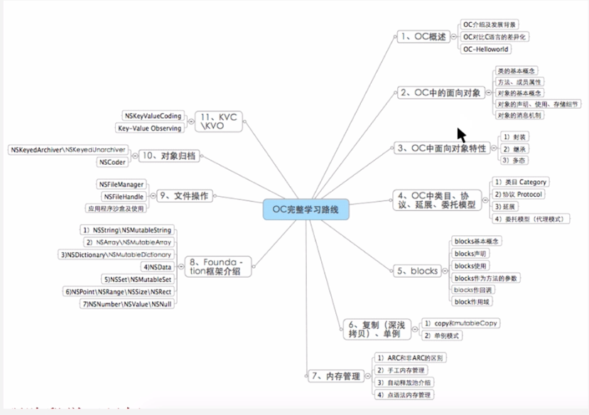

# 为什么要学习 Objective-C？

*   OC,是在 Swift 诞生以前 IOS、MacOS 开发的主要编程语言

*   一些项目随着苹果的更新或多或少都使用了 OC 与 Swift 混编



# OC和C语言有何种关系？

*   OC 是NextStep 公司对C语言进行一层封装后形成的新语言
*   在 C语言的基础上增加了面向对象思想
*   一些语法封装
*   OC 完全兼容 C 语言


# OC是如何写出HelloWorld的？

```objective-c
//
//  main.m  
//  项目名
//
//  Created by tiger on 2022/7/1.
//  Copyright © 2022 itcast. All rights reserved.
#import <Foundation/Foundation.h>
int main(int argc, const char * argv[]) { 
    @autoreleasepool {
        // insert code here...
        NSLog(@"Hello, World!");
    }
    return 0;
}
```


# HelloWorld.m中有哪些要点？

## 后缀名

- OC程序的源文件的后缀名是.m  m代表message 消息，代表OC中 消息机制

## #import

*   以#号开头，是预处理指令，同1个文件只要#import过,只会包含1份


   *   作用: 将文件的内容在预编译的时候拷贝写指令的地方

   *   原理: #import指令在包含文件的时候,底层会先判断这个文件是否被包含  如果被包含就会略过 否则才会包含

   *   C语言中，如果#include指令要实现这个效果 就必须要配合条件编译指令来实现

## main函数

*   是OC程序的入口和出口                                         &#x20;

### 返回值

-  int类型 代表程序的结束状态  

*   0 代表正常结束 非0代表非正常结束

### 参数

- 命令行运行时，可接收运行时用户入参 也可以无参数&#x20;

*   argc代表用户传递的数据的个数.
*   argv数组中每个元素存储的就是用户传递过来的数据.

## Foundation/Foundation.h

*   main 函数中引用了 Foundation框架中的 Foundation.h头文件
    *   Foundation.h 中包含了Foundation框架中的其他的所有的头文件
    *   Foundation.h位于如下路径：
        *   /Applications/Xcode.app/Contents/Developer/Platforms/MacOSX.platform/Developer/SDKs/MacOSX10.10.sdk/System/Library/Frameworks/Foundation.framework/Versions/C/Headers/Foundation.h

## @autoreleasepool：

- 叫做自动释放池

##  NSLog函数

- 向控制台输出信息
- ``` NSLog(@"格式控制字符串",变量列表);```

### 特点：

- 输出一些调试相关信息.

```
2020-07-01 12:40:52.628 Day01-OC基础语法[784:210576] Hello,World!
执行时间                   程序的名称    [进程编号:线程编号]  输出的信息. 
```

- 会自动换行 但手动在字符串结尾使用 ‘ \n ’ 则不会自动换行 


# OC 中如何使用字符串？

- 在OC中专门设计了1个NSString类型来存储字符串
- 字符串分为C字符串和OC字符串
  - "jack" 这是1个C语言的字符串.
  - @"jack" 这是1个OC的字符串常量.

- OC中使用 NSString类型的指针 存储字符串的地址.

- OC中，字符串常量必须要使用1个前缀@符号.

- NSLog函数的第1个参数是1个OC字符串,所以NSLog函数的第1个实参应该以@符号开头.

- 如果要使用NSLog函数输出OC字符串的值,那么使用占位符%@


# OC 中的NS前缀是什么意思？

- NextStep公司开发 OC ---> 公司更名为Cocoa ---> Foundation框架之中

#  OC 中的@前缀是什么意思？

-  将C字符串转换为OC字符串.

-  OC中的绝大部分的关键字都是以@符号开头.


# OC中的注释？

- 和C语言的注释一模一样.分为单行注释和多行注释.


# OC程序是如何运行的？

- 程序从代码到可执行文件的三个阶段：  预处理、检查语法、编译、连接、执行
- 点击运行按钮 所有的事情Xcode就帮助我们自动的做了

## 编译：使用编译器将源代码编译为目标文件

 终端中编译某一.m文件的命令：

``` 
cc -c xx.m
```

- 编译.m后会生成中间文件.o

## 链接

```
cc xx.o -framework 框架名称
```

- 如果程序中使用到了框架中的函数或者类.那么在链接的时候,就必须要告诉编译器去哪个框架中找这个函数或者类.

- 链接成功以后 就会生成1个a.out可执行文件 执行就可以了.


# OC中都有哪些数据类型？

## 支持C语言中的所有的数据类型.

- 基本数据类型：int double float char

- 构造类型：数组 结构体 枚举

- 指针类型： int *p1;

- 空类型：void
- typedef 自定义类型

## 新类型：

- BOOL类型：YES或者NO

  - 本质：有符号的char变量

    - typedef signed char BOOL; 
    - \#define YES ((BOOL)1）

    - \#define NO ((BOOL)0)

- Boolean

  - 可以存储true或者flase

  - 本质：无符号的char变量
    - typedef unsigned char     Boolean;
    - #define true 1
    - \#define false 0

- class 类型 类

- id类型 万能指针

- nil 与NULL差不多

- SEL 方法选择器
- block 代码段

 


# 总结

1. OC 是什么，和 C语言关系
2. 分析 HelloWorld
3. OC 程序是如何运行的
4. OC 中的数据类型

