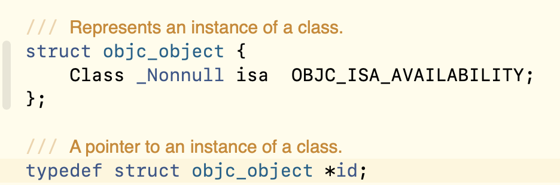

 # OC中的数据类型有什么特点?

- OC是1门弱类型语言
  - 编译器在编译的时候.语法检查的时候没有那么严格.
  - 强类型的语言: 编译器在编译的时候 做语法检查的时候 必须类型一致
- 静态类型:指针指向的对象是1个本类对象
- 动态类型:指针指向的对象不是本类对象

# OC中的编译检查和运行检查是什么?

- 编译器在编译的时候,判断1个指针能否调用其指向的对象的方法,这一操作被称为编译检查
  - 如果**指针所属的类型**中存在对应方法,编译通过
  - 如果**指针所属的类型**中不存在对应方法,编译报错

- 由于 OC 是弱类型语言,可以将指针的类型转换,使编译器不会报错
  - 但是在运行时会检查对象中是否真存在对应方法
    - 如果有就执行 ,没有就报错误
- 这两种检查方式分别被称为编译检查和运行检查

 #  LSP:里氏置换原则

- 父类指针指向子类对象
  - 这种情况下子类对象是父类的实际实现,从面向对象的思想来看,是一种细化的过程,所以编译器不会报错
  - 实际上在 OC 中,任意的指针可以执行任意的对象.编译器都不会报错
- 注意:子类指针可以存储父类对象,但无法调用子类中的有的属性以及方法

# OC 中的 NSObject 类

- 是OC中所有类的基类
- 根据LSP里氏替换原则, NSObject类型的指针可以指向任意一个OC对象.
- 从这一角度来看, NSObject类型的指针是1种万能指针,可以执行任意的OC对象.

- 但如果要调用对应子类对象的独有方法时,必须要做类型转换

  # id指针 --真正的万能类型

- 是1个万能指针,可以指向任意的OC对象.

- id是1个typedef自定义类型 在定义的时候已经加了\*,声明id指针的时候不需要再加*了.

# NSObject指针和id指针的异同

- 相同点: 
  - 万能指针 都可以存储任意的OC对象
- 不同点: 
  - NSObject指针 调用对象的方法时 编译器会做编译检查.
  - id类型的指针 调用对象的方法时 编译器直接通过.无论你调用什么方法.

- 注意:
  -  id指针只能调用对象的方法 不能使用点语法.如果使用点语法就会直接报编译错误
  - 声明1个万能指针时 应该使用 id

# id 指针的其他应用:

## 父类中的类方法,返回一个父类对象,此方法需要子类进行调用

- 子类不能存储父类对象,如果返回值写为父类类型的.那么子类来调用这个方法得到的就是父类指针.
  - 可以把返回值改为id类型,但此时任意指针都可以接收这个方法的返回值,且编译器不会发出警告
  - 此时可以使用instancetype
  - 注意:
    - 方法的内部创建的对象时一般不要写死;因为写死创建的对象就固定了

## 任意类来调用某方法就创建那个类的对象

- 通过 [self new] 方式创建本类对象
- 返回值 不使用 id 而是用 instancetype 

 

# id和instancetype的区别

- 不同点:

  - instancetype只能作为方法的返回值.不能在别的地方使用.
  - instancetype 是1个有类型的 代表当前类的对象.

  - id既可以声明指针变量 也可以作为参数 也可以作为返回值.

  - id是1个无类型的指针 仅仅是1个地址.没有类型的指针.

 

# 编译检查中可以使用哪些操作?

## 判断对象中是否有这个方法可以执行.

~~~
- (BOOL)respondsToSelector:(SEL)aSelector;
~~~

## 判断类中是否有指定的类方法.

   ~~~
   + (BOOL)instancesRespondToSelector:(SEL)aSelector;
   ~~~

## 判断指定的对象是否为 指定类的对象或者子类对象.

  ~~~
  - (BOOL)isKindOfClass:(Class)aClass;
  ~~~

## 判断对象是否为指定类的对象 不包括子类.

  ~~~
  - (BOOL)isMemberOfClass:(Class)aClass;
  ~~~

## 判断类是否为另外1个类的子类.

~~~
+ (BOOL)isSubclassOfClass:(Class)aClass;
~~~

​    

 

 