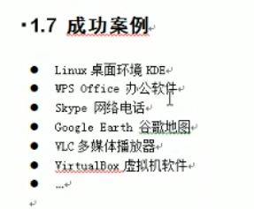

课程内容介绍

 

第一章 Qt入门

 

1- Qt概述

Qt是一个跨平台的C++图形界面应用程序框架。它提供给开发者建立图形用户界面所需的功能，广泛用于开发GUI程序，也可用于开发非GUI程序。Qt很容易扩展，并且允许真正地组件编程。基本上，Qt同X Window上的Motif,Openwin,GTK等图形界面库以及Windows平台上的MFC、OWL、VCL、ATL是同类型的东西。

成功案例：

Linux桌面环境

Qt	商业版

开源版（LGPL）

 

QML

帮助界面

QT属于前端开发

 

2- 第一个Qt小程序

路径名中不能有中文

基类中：

QMainWindow和QDialog军继承于QWidget

QWidget：最基本的窗口

QMainWindow：多了菜单栏工具栏状态栏

QDialog：带对话框的窗口

 

版本控制系统：SVN VSS GIT

svn：能够合并多个人的代码

每个人写之前需要update

一旦忘记更新会报错，需要slove（解决冲突）

commit：提交

lock：无法提交，无法update

pro文件，类似于.sln文件

3- 信号和槽机制

 

第二章 Qt界面编写

 

1- Qt窗体

 

2- 常用控件

 

3- 布局管理

 

第三章 Qt高级

 

1-消息机制和事件

 

2-绘图设备

 

3-文件系统

 

第四章 实例演练

 

1- 项目配置

 

2- 设置各个场景

 

3- 游戏类设计

 

4- 特性设计

 

5- 音效和优化

 