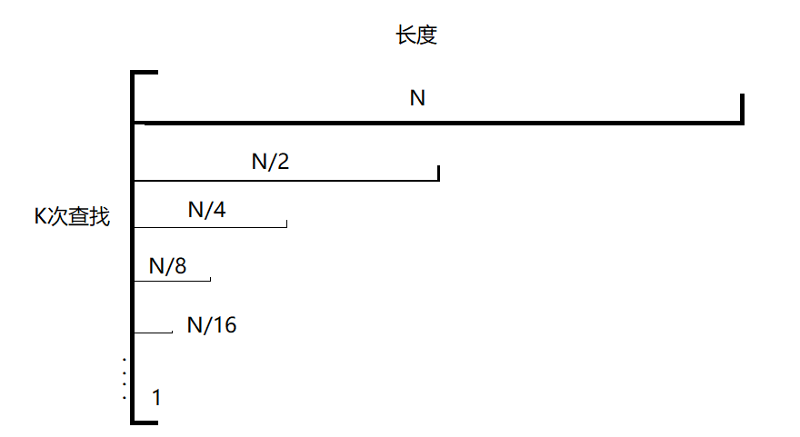

# 快速排序

## 回忆冒泡排序:

- 相邻两元素大小比较
- 冒泡排序的比较次数(n个元素):
  - (n-1)+(n-2)+...+1
  - 时间复杂度为O(n^2^),需要优化
  - 快速排序为冒泡排序的优化版本

## 快速排序的引入(折半思想)

### 猜数问题的第一步:

- 数字的范围是0~100,首先要猜哪个数字,能够更有可能的确定目标数字?
  - 50
- 原因:
  - 50将整个区域划分为两个等大小的区域
  - 下次猜时,同时两个区域内出现目标值的可能性是相等的
  - 可能性是相等的及可确定此问题的**最优下界**
  - 这种思想在二分搜索中也有应用

### 二分查找的比较次数(折半思想的应用):

- $$
  n/2(k-1)=1
  
  K=logn+1
  $$

- 这种思想的时间复杂度(二分查找的时间复杂度)=O(logn)

## 核心思想:

1. 确定标准值
2. 将比标准值小的放在其左侧
3. 将比标准值大的放在其右侧
4. 左右两部分分别重复以上操作

## 快速排序的多种实现方法:(寻找标准值的方式不同)

### 挖坑填补法:

- 根据标准值，将序列分成两部分

#### 挖坑填补法过程：

##### 思想：(分治思想:分割小问题,每个小问题类型均相同)

1. 确定开始标准值位置
   1. 一般确定为首元素位置
2. 开始分割问题,并处理子问题
3. 使用递归方法
   1. 参数设定为(数组名,起始位置,结束位置)

##### 基本流程:

1. 先找标准值,将其位置空出来,形成一个坑
   1. 一般确定为首元素位置
2. 右指针从右向左遍历
   1. 找比标准值小的放在左边的坑中
3. 左指针从左向右遍历
   1. 找比标准值大的放在右边的坑中
4. 重复2,3,直至左右指针相遇
   1. 将标准值放入对应坑中
5. 将原序列依照标准值所在位置分成左右两子序列
   1. 左子序列:起始位置,标准值-1
   2. 右子序列:标准值+1,结束位置
6. 分别对两序列执行1~5过程,直至任意序列只剩一个元素,此子序列排序结束

循环效率低。

### 区间分割：系统效率优化 

#### 基本思想:

- 标准值选择最后一位数，
- 从序列头开始遍历,比标准值小的放在标准值前面，比标准值大的留在后面
    - 下标变量以分割有序区间与无序区间
- 不断扩张小于标准值区间，走到标准值位置时结束，
    - 将标准值移至大小区间交界处
        （小于区间的下一个位置与标准值位置交换），
- 对两个区间重复以上操作

#### 注意:

- 当标准值为数组中最大/最小值快排优势消失；

## 快速排序优化办法(根据措施优化)
### 选取标准值（保证不选中最大或最小值）：

- 可随机选择3个数,选取其中的中间值
    - srand和time消耗时间
- 3选1:选择**首位,末尾,中间位**三个值取中间值作为标准值
    - 大量数据时选择到相同数值时无意义
- 9选1:选9个数分三组，每组选一个中间值，所得三个中间值在选一个中间

### 快速排序的最坏情况:

- **序列有序**

- **序列为有序的倒序**

   ### 与标准值相同数据出现次数过多 ：特殊情况优化Ⅱ
将相同数据放置于标准值两侧使标准值形成一个小区间是下一次操作的区间范围直接缩小；

比较时添加相等判断,相等时将数据以东至序列的最前.最后位置,比较完成后将几个相等数据聚集在一起

### 利用其他种类的排序:

当快速排序分割区间后两区间元素个数均较少时可直接转化至插入排序

当快速排序中剩余元素的数量少于5个时,转而使用插入排序并结束递归能够减少空间上的消耗

### 快速排序的一般系统异常处理：

- 若当时栈区空间中占用过多再使用递归方法排序时可能导致空间溢出（算法正确）
- 取代递归：循环加辅助栈

### 尾递归方法：

- C语言中优化    Java C#中不适用